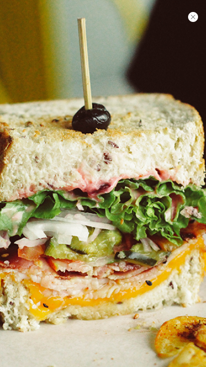
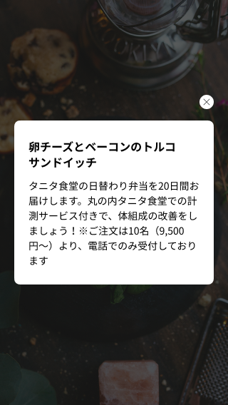
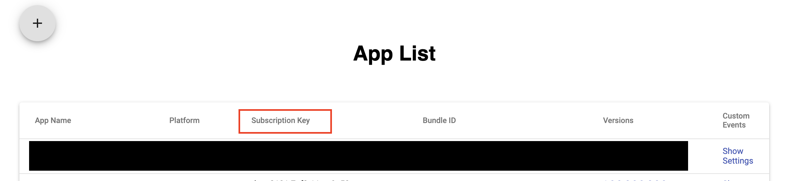
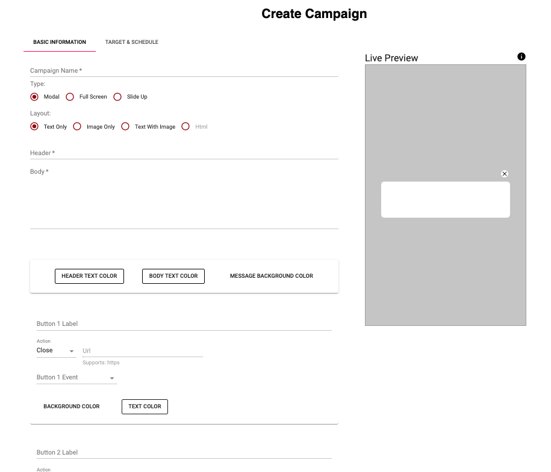
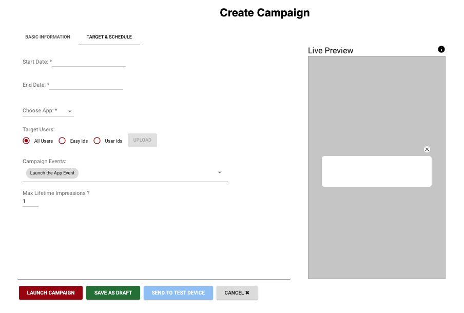

# In-App Messaging
The In-App Messaging module enables applications to receive notification, which are displayed within the app, from [Rakuten In-App Messaging Dashboard](https://inappmessaging.rakapi.com/)


### This page covers:
* [Features Overview](#features)
* [Requirements](#requirements)
* [Getting Started](#getting-started)
* [SDK Integration](#integration)
* [FAQ](#faq)
* [Documentation and Useful Links](#see-also)
* [Change Log](#nchangelog)

## <a name="features"></a> Features Overview
### Message Type
| #1 Modal | #2 Full Screen | #3 Slide-Up |
|-------------------|-------------------|-------------------|
|  |  |  |

### Message Layout
| #1 Text Only | #2 Image Only | #3 Text and Image | #4 HTML |
|-------------------|-------------------|-------------------|-------------------|
|  |  |  | Coming soon |

### Actions (Optional Buttons)
#### #1 Close
Closes the In-App message on tap.

#### #2 Redirect
Launches the URI in an external  browser on tap.

#### #3 Deeplink
Launches the URI in an external  browser on tap.

### Triggers
This are events sent from the host app which are used as conditions if a specific campaign/message should be displayed.

#### #1 App Start Event (pre-defined)
Event which the host app can send after every app launch, including first launch, or resume.

#### #2 Login Successful Event (pre-defined)
Event which host app can send after every time user login.

#### #3 Purchase Successful Event (pre-defined)
Event which the host app can send after every purchase.

#### #4 Custom Event (customizable)
Event which host app can send after app-defined states or conditions.
Custom events can have attributes with names and values. Attributes can be integer, double, String, boolean, or java.util.Date type.

## <a name="requirements"></a> Requirements
### Supported Android Versions
This SDK supports Android API level 21 (Lollipop) and above.

### In-App Messaging Subscription Key
You must have a subscription key for your application from [Rakuten In-App Messaging Dashboard](https://inappmessaging.rakapi.com/).<br/>
Please go to [App Settings](https://inappmessaging.rakapi.com/app/settings) page to create/add app and for retrieving of subscription key.<br/>


## <a name="getting-started"></a> Getting Started

### How does In-App Messaging work?


### #1 In-App Messaging Dashboard
The In-App Messaging Dashboard enables you to operate and manage your In-app messaging campaign on the Rakuten Platform.<br/>
For more information, please refer to [dashboard user manual](https://inappmessaging.rakapi.com/help).

### #2 Register application and retrieve subscription keys
Please use the [App List](https://inappmessaging.rakapi.com/app/settings) page to create, and manage your apps.<br/>
You can add/delete versions, and retrieve the subscription keys in the App List page.

### #3 Integrate the In-App Messaging SDK to your app.
Please refer to [SDK Integration](#integration) section.

### #4 Create a campaign/message
Please use the [Create Campaign](https://inappmessaging.rakapi.com/campaign/create) page to create, edit, save as draft, launch, cancel edition for campaigns.
* Input in-app messaging's UI Information in **Basic Information Tab**

  * Enter the **Campaign Name**.
  * Choose message **Type**.
  * Choose message **Layout from Text only, Image Only, Text With Image**. (**HTML** rich content support will coming soon.)
  * Enter the in-app message **Header** which is a required field.
  * Enter the in-app message **Body** which is an optional field
  * Define the **Message Background Color**. The default is white.
  * Define the number of **Buttons**, **Button Label**, **Button Actions**.<br/>
* Input in-app messaging's target and scheduling information in **Target & Schedule Tab**

  * Define campaign message **Start Date** and **End Date**.
  * **Choose App** and **Versions** - Choose which app in your app group you are going to apply to the campaign.
  * Click "+" to add multiple apps.
  * **Target Users** - You can target all your audience with select All Users, you can also target users by upload a CSV file with a list of Easy Ids or User Ids.
  * You can select the message trigger at the **Campaign Events** field, we support: **Launch the App Event**, **Login event**, **Purchase Successful Event** as default. You can add your own custom event at [App Settings](https://inappmessaging.rakapi.com/app/settings) page.
  * Max Lifetime Impressions - You can manage the number of messages your user will see.<br/>
* **Launch Campaign** - Live a campaign message. This function only available for the Administrator role.
* **Save as Draft** - Save a campaign as a draft message. This function is available for all roles.
* **Send to Test Device** - Send your draft campaign message to the actual test device. You can use easyId or userId (Rakuten user login Id) to target which user you want to send the test message to.
* **Cancel** - Cancel the editing of campaign

Note: You can create up to 100 campaigns per app group.

### #5 Send/display message
Message are displayed if the triggers/conditions for the campaign are satisfied in the application.


## <a name="integration"></a> SDK Integration
### #1 Include Artifactory in your project, this should be added in your project root `build.gradle` file. Note: Crimson House Intra connection is needed.

```groovy
allprojects {
    repositories {
        jcenter()
    }
}
```

### #2 Add InAppMessaging SDK in your project dependencies. Note: InAppMessaging SDK only uses AndroidX libraries, recommend host apps to migrate to AndroidX to avoid duplicate dependencies.

```groovy
dependencies {
    implementation 'com.rakuten.tech.mobile:inappmessaging:${latest_version}'
}
```
Please refer to [Changelog](#changelog) section for the latest version.

### #3 Target and compile SDK version to 28 or above.
Note: It is required to target and compile to SDK version 28 or above.

```groovy
android {
    compileSdkVersion 28

    defaultConfig {
    // Defines the minimum API level required to run the app.
    minSdkVersion 21
    // Specifies the API level used to test the app.
    targetSdkVersion 28
    }
}
```

### #4 Adding subscription ID and config URL to your app's AndroidManifest.xml file.

```xml
<meta-data
    android:name="com.rakuten.tech.mobile.inappmessaging.subscriptionkey"
    android:value="change-to-your-subsrcription-id"/>

<meta-data
    android:name="com.rakuten.tech.mobile.inappmessaging.configurl"
    android:value="change-to-config-url"/>
```

If you want to enable debug logging in In-App Messaging SDK (tags begins with "IAM_"), add the following meta-data in AndroidManifest.xml file.
```xml
<meta-data
    android:name="com.rakuten.tech.mobile.inappmessaging.debugging"
    android:value="true"/>
```

### #5 Creating an UserInfoProvider.
Create a new class in your project which implements the following file:
`com.rakuten.tech.mobile.inappmessaging.runtime.UserInfoProvider` <br/>

This class serves the purpose of providing basic user information such as userId, rakutenId, and RAE token at runtime.
Note: only provide RAE token if the user is logged in.

### #6 Initializing In-App Messaging SDK.
In-App Messaging is automatically initialized at startup and handled on a background thread.
Host app just needs to register the provider containing the user information.

In your Application's `onCreate()` method, add:

```kotlin
InAppMessaging.instance().registerPreference(YourUserInfoProvider())
```

### #7 Registering and unregistering activities.
Only register activities that are allowed to display In-App messages.
Your activities will be kept in a WeakReference object, so it will not cause any memory leaks.
Don't forget to unregister your activities in `onPause()` method.

```kotlin
override fun onResume() {
    super.onResume()
    InAppMessaging.instance().registerMessageDisplayActivity(this)
}

override fun onPause() {
    super.onPause()
    InAppMessaging.instance().unregisterMessageDisplayActivity()
}
```

Note: There could be exceptions thrown during initialization, if Subscription ID or other critical information is not found.

### #8 Logging events
Host app can log events to InAppMessaging anywhere in your app.

These events will trigger messages with the same event based trigger. Upon receiving logged event, InAppMessaging SDK will start matching it with current campaigns immediately. After a campaign message's trigger events are matched by the logged events, this message will be displayed in the current registered activity. If no activity is registered, it will be displayed in the next registered activity.

Pre-defined event classes:<br/>
`AppStartEvent` - Host app can send this event on app launch from terminated state. Recommended to log this event in host app's base activity's onStart().

`LoginSuccessfulEvent` - Host app can send this event after every time user login. Please note: this will trigger InAppMessaging SDK to update current session data to the new user.

`PurchaseSuccessfulEvent` - Host app can send this event after every purchase.

```kotlin
InAppMessaging.instance().logEvent(AppStartEvent())
```

Custom event class:
`CustomEvent` - Host app can send custom events to InAppMessaging SDK.

* Every custom event requires a name(case insensitive), but doesn't require to add any attributes with the custom event.
* Each custom event attribute also requires a name(case insensitive), and a value. Supported custom event attribute value type are: integer, double, String, boolean, and java.util.Date.
* Recommend using English characters only.
* Because the custom event's name will be used when matching campaigns with triggers; therefore, please make sure the actual campaign event's name and attribute's name must match with the logged events to InAppMessaging SDK.

```kotlin
InAppMessaging.instance().logEvent(CustomEvent("search").addAttribute("keyword", "book").addAttribute("number_of_keyword", 1))
```

### #9 Updating user information
User information or preference is what will allow InAppMessaging to identify users for targeting and segmentation.
Update the app's session when new user login or on logout. If app session is not updated, incorrect messages may be displayed or some messages will not be displayed.

```kotlin
InAppMessaging.instance().updateSession()
```

## <a name="troubleshooting"></a> Trouble Shooting
`proguard.ParseException`

```kotlin
Caused by: java.io.IOException: proguard.ParseException: Unknown option '-if' in line 84 of file
This error will be thrown during compilation if `minifyEnabled = true`, and your Proguard version is below 6.0.
```

Recommendation: Update your project's Android Gradle Plugin to the latest version, it includes the latest version of Proguard.

Less optimal solution: Force Gradle to use the latest version of Proguard(https://sourceforge.net/p/proguard/discussion/182455/thread/89a4d63d/):

```groovy
buildscript {
    ...
    configurations.all {
      resolutionStrategy {
        force 'net.sf.proguard:proguard-gradle:6.0.3'
        force 'net.sf.proguard:proguard-base:6.0.3'
      }
    }
}
```

## <a name="faq"></a> Frequently Asked Questions
### Q: How do I send message for in staging or testing environment?
When creating [campaigns](https://inappmessaging.rakapi.com/campaign/create), you can set the versions which the campaign will be applied to your app.
You can set the versions to staging versions (ex. 0.0.1, 1.0.0-staging, 0.x.x, etc.)

### Q: How many times In-App Message should be sent to test device? Does it depends on Max Lifetime Impressions?
The max impression is bind to per device ID.<br/>
1. Scenario- Max impression set to 2. User does not login with Rakuten ID or Easy ID. So It will be shown in single device for 2 times.
2. Scenario- Max impression is set to 2. User login with Rakuten ID or easy ID for 2 devices. It will show 2 times per devices.
3. The campaign start time can be shown

### Q: Is the campaign displayed if ALL or ANY of triggers are satisfied?
All the events "launch the app event, login event, purchase successful event, custom event" work as AND. It will send to the device only all defined event are triggered.

## <a name="see-also"></a> Documentation and Useful Links
Documents targeting Engineers:

+ [SDK Source Code](https://github.com/rakutentech/android-inappmessaging)

Documents targeting Product Managers:

+ In-App Messaging Dashboard Sign Up(page is coming soon.)

## <a name="changelog"></a> Changelog

### 2.x.x (TBD)
* SDKCF-2054: Converted In-App Messaging to Kotlin
* SDKCF-1614: Polish the Public API (removed unnecessary public APIs)
* SDKCF-2342: easy_id targeting
* SDKCF-2353: Rakuten ID targeting

### 1.4.0
* Adding feature embedded event in action buttons.
* Fix UI bug on SlideUp messages.
* Fix race condition bug when initializing SDK.

### 1.3.0
* Adding support of Full Screen messages.
* Adding support of Slide Up messages.
* Adding support of message opt-out option for Full Screen and Modal messages.

### 1.2.0
* Adding Gif support.
* Removing RAT Broadcaster dependency, hence completely removing Android Support Libraries from InAppMessaging SDK.
